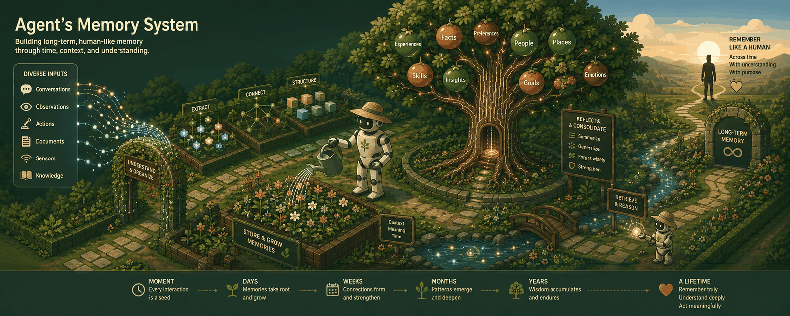

<p align="center"></p>

# MemGarden

A ground-up **Rust rebuild** of my personal long-term memory system for Claude Code — local-LLM fact extraction, hybrid recall, an interactive memory graph, and overhead-free savings metrics, all in one self-contained daemon.

## What it's for

An AI coding assistant starts every session amnesiac. It re-reads the same files, re-derives the same conclusions, and asks you things you settled last week. MemGarden is the layer that stops that: conversations are captured automatically, distilled into facts by a local LLM, linked to each other, and served back — in about seven milliseconds — as the handful of memories that matter for the prompt you just typed.

The name is the design. Memory here is not a bucket you throw things into; it is **tended**. Sessions rain down through hooks. Facts take root in per-project banks. Consolidation prunes duplicates and grafts observations into knowledge. A ledger keeps honest books on what the garden actually yields. Nothing leaves the machine it grows on.

## What makes it different

- **One binary, one file, zero external processes.** SQLite with sqlite-vec and FTS5 does vectors, keywords, and the graph in-process. No database server to start, no restart race to lose data to, and a backup is `cp memgarden.db`.
- **Fast enough to be invisible.** Recall measures **p50 7.1ms / p95 7.8ms** at 3,000 memories with all four retrieval arms live, against a 35ms budget — so the memory layer never becomes the reason a prompt feels slow. Under concurrent ingest that pushes the bank past 35,000 nodes it still clears the 60ms ceiling.
- **Local by construction, not by policy.** Extraction runs on your own Ollama; embeddings and reranking are compiled into the binary and run on CPU so they never fight the LLM for VRAM. There is no cloud path to accidentally enable.
- **Honest about its own value.** Every retain records what the input caps saved (**−75.3%** on a live extraction, **−86.9%** over a whole 5.8MB transcript) into a benefit ledger. Metrics collection costs **88ns per request** — 0.00025% of the latency budget — so measuring the system can never distort what it measures.
- **Korean works properly.** CJK has no word boundaries, so a naive full-text index silently returns nothing — measured: a 5-token Korean prompt retrieved **0** hits before the fix and 100 after. The FTS layer is built for it (unicode61 + prefix indexing + prefix-suffixed terms) and a guard test fails the build if that ever regresses.
- **Bounded everywhere it touches untrusted input.** Transcripts, tool payloads, entity names, prompt sizes, and queue depth all have caps with tests — because in the previous system each of those, uncapped, produced a real incident.
- **Recall quality is measured, not asserted.** A committed 2,718-fact corpus and 20 graded gold queries produce recall@k / MRR / nDCG, so a ranking change reports a delta instead of a feeling. It has already paid for itself: the embedded reranker looked like a +0.077 nDCG win until a temporal bug was fixed, after which the same measurement showed **+0.013 nDCG@10 with recall@10 going 0.044 negative** — which is why it ships off.
- **Reviewed like it matters.** Every change lands as a PR through a three-way review (functional / security / code), and fixes are confirmed by **mutation-testing them** — reverting the fix has to fail a test, or the test does not count. That discipline is also how the suite's own blind spot was found: a lock regression whose mutation survived every test, because every test ran one hook at a time.

## Why rebuild

The legacy stack (hindsight daemon + embedded Postgres + Python hooks) works, but every operational lesson it taught pointed the same direction:

- **Latency came from process sprawl** — 830ms recalls traced to GPU contention and a per-request `gc.collect` in a sidecar; fixed by config, but the lesson is architectural: fewer moving parts, no per-request penalties by construction.
- **Restart races** (embedded Postgres vs daemon) disappear when storage is an in-process SQLite file.
- **Unbounded inputs break things** — a 102MB transcript blew a retain wall-clock; an unbounded consolidation prompt outgrew the model context. Every MemGarden ingest path is capped by design, server-side.
- **Benefits must be measured, not vibed** — the [3-layer measurement framework](https://github.com/ohora23/memgarden-legacy/blob/master/docs/measurement.md) needs zero-latency counters built in, not bolted on.

## Architecture

```
Claude Code hooks (Rust subcommands, measured 0.85ms per turn — budget 10ms)
        │ raw transcript / query
        ▼
memgardend (axum, :9100) ──────────── web UI (dashboard + graph viewer, Phase E)
 ├─ retain: caps → chunk → Ollama extraction → facts + entities + links
 ├─ recall: FTS5 BM25 + sqlite-vec KNN → RRF fusion → token budget
 ├─ consolidate / reflect / reranker (off by default — see below)
 ├─ in-binary embeddings (fastembed, bge-small 384-dim, CPU)
 └─ metrics: lock-free atomics (74ns/op) + benefit ledger
        ▼
 single SQLite file (WAL, STRICT) — vec0 vectors + FTS5 + graph tables
```

| Decision | Choice | Why |
|---|---|---|
| Storage | SQLite + sqlite-vec (`=0.1.9`) + FTS5, external processes: **zero** | No restart races, one-file backup, and brute-force KNN keeps whole-recall p95 under 10ms at 3k nodes |
| Extraction LLM | Ollama HTTP (default `qwen3-14b-nothink`), swappable | GPU belongs to the big model; the daemon never competes for it |
| Embeddings / rerank | In-binary, CPU-forced | Measured 2.4ms embed p50 / 10.4ms per rerank call on CPU; VRAM contention was the #1 legacy latency bug |
| Korean search | FTS5 `unicode61` + `prefix='2 3 4'` + `*`-suffixed query terms | CJK has no word boundaries; guard-tested so recall can't silently degrade |
| Concurrency | One Ollama permit, background/interactive acquire split, hard deadlines | A 14B model on one GPU must be queued for, never raced for |
| Metrics | Static atomics, no LLM calls, `/metrics.json` + `benefit_ledger` table | Zero added latency on hot paths is an acceptance gate, not a hope |

## Status

Work lands as PRD-tracked pull requests (template in `.github/`), each 3-way reviewed (functional / security / code) before merge.

| Phase | Scope | State |
|---|---|---|
| A — Foundation | workspace/CI, SQLite schema, REST skeleton, metrics plumbing (CE-1..3, MX-1) | ✅ merged |
| B — Core pipeline | embeddings CE-4 · Ollama extraction CE-5a · retain ingest CE-5b · hybrid recall CE-6 · entities/graph CE-7 · temporal CE-8 · consolidation CE-9 · reflect CE-10 · reranker CE-11, plus vector-space tagging AX-1 and the recall-quality harness AX-2 | ✅ merged |
| C — Hooks | session/turn state ✅ · CLI foundation + hook-latency harness ✅ · session-start ✅ · recall ✅ · transcript delta ✅ · retain ✅ · install & cutover switch ✅ | ✅ code-complete |
| D — Migration | Postgres → SQLite exporter, lossless-verification script | ⏳ next |
| E — UI & metrics | dashboard, graph API, WebGL viewer (pan/zoom/drag, live SSE), ledger views | ⏳ |
| F — Cutover | quality-parity A/B + performance gates + lossless migration → legacy shutdown | ⏳ |

**Where the cutover gates stand.** All three must pass before the old system is shut down:

| | requirement | state |
|---|---|---|
| **AC-1 quality** | recall quality ≥ legacy on a fixed query set, human-judged | 🔄 **collectable now** — shadow-mode install logs what MemGarden *would* have injected, prompt by prompt, while legacy still drives the session |
| **AC-2 performance** | recall p50 ≤35ms / p95 ≤60ms, hook overhead <10ms, retain cap savings held | ✅ **met** — 7.1/7.8ms recall, **0.85ms of hook per turn**, −75…−87% savings |
| **AC-3 lossless migration** | node/link/document counts match across 3 banks + 50-sample content diff | ❌ **not met** — needs Phase D, and one open cursor defect in front of it |

**Next up, in order:** collect the AC-1 shadow evidence · close the `chunks_failed` cursor gap (a `done` job with a failed chunk opens a window the durable cursor then hides) · Phase D migration · the web UI.

## Claude Code hooks

Four hook subcommands of one small binary (496 KB–1.6 MB, glibc only, no
tokio/SQLite/ONNX in its dependency closure — CI-enforced), wired into
`~/.claude/settings.json` by the binary itself:

```bash
memgarden hooks install --dry-run    # print the exact lines, write nothing
memgarden hooks install              # shadow mode — wires everything, injects nothing
memgarden hooks status               # which system is wired per event, daemon health, poisoned sessions
memgarden hooks uninstall            # restores the file to its pre-install bytes
```

Measured per invocation, interleaved-paired against the same binary doing
nothing, N=300 — the whole per-turn cost is `recall` + `retain` = **0.85 ms**
against the 10 ms budget:

| | `session-start` | `recall` | `retain` (gated turn) | `session-end` |
|---|---|---|---|---|
| p50 | 0.549 ms | 0.465 ms | 0.380 ms | 0.361 ms |
| p95 | 0.624 ms | 0.526 ms | 0.435 ms | 0.416 ms |

Three properties the design is built around, all tested rather than intended:

- **It can never exit 2.** On `UserPromptSubmit` exit 2 *erases what you typed*.
  There is no `clap` (its usage errors exit 2), no `?` out of `main`, and a
  panic hook that exits 0 with empty stdout.
- **Installing turns nothing on.** Wiring lives in `settings.json`, injection
  in `config.toml`, and the default install wires all four events in *shadow*
  mode — real daemon calls, real latency, and nothing reaches the model.
- **`settings.json` is edited by line splice, never reserialized.** Uninstall
  restores the file byte for byte; a `serde_json` round-trip would silently
  re-sort every key in a file shared with other tools.

Full runbook — install, verify, shadow-evidence collection, rollback,
coexistence with the legacy hooks: [`docs/runbook-hooks.md`](docs/runbook-hooks.md).

## Performance

Every number here is measured on this machine (Ryzen 7 9800X3D, 16 threads, release build) and traceable to a design note in `docs/design/`. Two caveats travel with them, because the notes insist on it: **absolute latencies on this box drift ±1.5ms between runs of identical bits**, so paired deltas are the trustworthy figures; and the recall-quality labels are **provisional on 19 of 20 gold queries**.

### Recall — the budget that matters

| | p50 | p95 | p99 | conditions |
|---|---|---|---|---|
| **idle** | **7.1ms** | **7.8ms** | 8.7ms | 3,000 nodes, 2,000 requests, all four arms (BM25 + vector + graph + temporal) |
| **under concurrent ingest** | 19.6ms | 48.8ms | — | same, while a background loader writes ~35,700 nodes into the same bank |
| budget (AC-2) | ≤35ms | ≤60ms | | 1,605/2,000 under 35ms and 1,997/2,000 under 60ms in the loaded run |

Per-arm, isolated: graph 0.29ms p50, temporal 0.13ms p50 (0.54ms worst case), mental-model KNN 0.20ms p50 at 1,000 models. The scaling ceiling is the brute-force vector scan — whole-recall p95 is 9.7ms at 3k nodes and 40.7ms at ~32k, which puts the upgrade point somewhere near 50k.

Through the hook, against a live daemon and the 2,718-fact gold bank: **p50 7.96ms / p95 8.91ms / p99 9.49ms** end to end, on a Korean query — 7× inside the 70ms gate.

### Hooks — 0.85ms of the 10ms allowance

Interleaved-paired against the same binary doing nothing, N=300 per arm:

| | `session-start` | `recall` | `retain` (gated turn) | `session-end` |
|---|---|---|---|---|
| p50 | 0.549ms | 0.465ms | 0.380ms | 0.361ms |
| p95 | 0.624ms | 0.526ms | 0.435ms | 0.416ms |
| paired p50 (own work) | 0.255ms | 0.183ms | 0.102ms | 0.084ms |

**A whole turn is `recall` + `retain` = 0.845ms p50 / 0.961ms p95.** The comparison that matters is not the budget but the system this replaces: the legacy Python hooks cost **33ms on their disabled path** — more to do nothing than these cost to work. An equivalent Python hook measured 24ms cold, so AC-2's <10ms was never reachable in that language.

Two declared exceptions: the **first retain of a session** sends the whole transcript (68.6ms on a 21.9MB file, once per session, which is why the `Stop` entry is `async`), and a **hung daemon** costs 1.5s on the first prompt before the circuit breaker takes over.

The binary is 1.58MB, links only glibc/libgcc/vdso, and its dependency closure is CI-enforced — no tokio, no SQLite, no ONNX in a process that runs thousands of times per session.

### Ingest and extraction

| | measured | conditions |
|---|---|---|
| embedding, single | 2.41ms p50 / 3.39ms p95 | bge-small, 384-dim, fp32 ONNX, CPU |
| embedding, corpus | 26.2s for 2,718 nodes | real drain worker including its KNN pass |
| transcript delta read | 0.46ms for a 200KB tail; 64.3ms to parse 106.9MB | byte-offset resume, so the common case never re-reads |
| input-cap savings | **−75.3%** live, **−86.9%** over a 5.8MB transcript | written to the benefit ledger on every retain |
| consolidation round | 151s for 50 facts | real Ollama qwen3-14b-nothink, ~50% duty cycle against a 300s interval |
| reflect | 1.70s warm, 6.21s cold | 3 memories in the payload |

Extraction wall time is **deliberately not quoted**: the one live measurement (564s for three chunks) ran on a GPU shared with the legacy daemon and against a pathological fixture. It needs re-measuring on an idle card before it means anything.

### Cost of measuring

One `record` call is **74.3ns**; the full set a `POST /recall` touches — four counters and two histograms — is **87.7ns per request**. That is 0.00025% of the 35ms SLO, which is what makes "zero added latency on the hot path" an acceptance criterion rather than a hope.

### Recall quality

Against a frozen 2,718-fact corpus with 20 graded queries and 331 judgments, macro-averaged, Burges/TREC nDCG:

| | recall@1 | recall@5 | recall@10 | MRR | nDCG@10 |
|---|---|---|---|---|---|
| shipped (RRF, no reranker) | 0.038 | 0.243 | **0.403** | 0.551 | 0.340 |
| with the reranker, top_k=10 | 0.047 | 0.258 | 0.358 | **0.701** | 0.352 |

The reranker wins ordering (+0.150 MRR) and loses coverage (−0.044 recall@10) for +13.7ms p50 / +31.8ms p95, and it drops background ingest to 89.9% of offered load. That is why it ships **off** — with a written re-entry criterion rather than a verdict.

## Documentation

- **[Wiki](book/src/introduction.md)** — install, usage, how it works, extending it, roadmap. English canonical, Korean alongside. Build it locally with `mdbook serve book`.
- `docs/design/` — one design note per merged PR, each standing alone without the diff
- `docs/parity-gaps.md` — legacy behaviour deliberately not ported, each row with the fact that would reopen it
- `docs/runbook-hooks.md` — install, verify, collect shadow evidence, roll back
- `docs/PRD.md` — the deep-interview spec this repo executes

## Development

```bash
cargo test --workspace                       # full suite (unit + API + schema)
cargo clippy --workspace --all-targets -- -D warnings
cargo run -p memgardend                      # daemon on 127.0.0.1:9100
cargo test -p memgardend -- --ignored        # live tests (need Ollama running)
cargo run -p memgarden-cli --bin hook_bench  # hook latency, interleaved-paired
./scripts/hook-budget.sh                     # binary size, ldd set, dependency closure
mdbook serve book                            # the wiki, at http://localhost:3000
```

Configuration: `config.example.toml` → `~/.config/memgarden/config.toml`, env overrides `MEMGARDEN_*`. The daemon creates its data dir `0700` and speaks plain HTTP on loopback with a Host-header guard — it is a single-user local tool by design.

## Repo map

- `crates/memgarden-core` — types, config, lock-free metrics
- `crates/memgarden-store` — SQLite layer (migrations, vec/FTS, banks/nodes/search/ledger)
- `crates/memgardend` — the daemon (routes, Ollama client, extraction, retain pipeline, embed worker)
- `crates/memgarden-cli` — the `memgarden` hook binary (loopback HTTP, session state, bank derivation, transcript delta reader, and the `settings.json` installer); dependency-closure-checked in CI, because a hook pays for its binary on every invocation
- `gold/` — the frozen recall-quality corpus, graded queries, and the results ledger
- `book/` — the wiki: install, usage, design, extending, roadmap (English + Korean), built with mdBook
- `docs/PRD.md` — the deep-interview product spec this repo executes
- `docs/design/` — one design note per merged PR (mirrored to my Obsidian vault)

## Lineage

- [memgarden-legacy](https://github.com/ohora23/memgarden-legacy) — Python-era system: role-split architecture, ops runbook, fork patches, memdash/memcompare tooling, and the measurement framework whose numbers set this rebuild's acceptance bars
- [ohora23/hindsight `claude-code-integration`](https://github.com/ohora23/hindsight) — the fork whose caps, tags, and profile presets are ported server-side here
